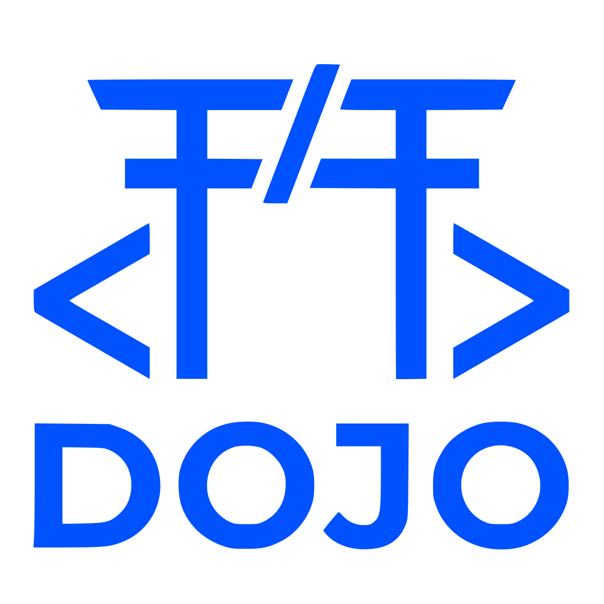
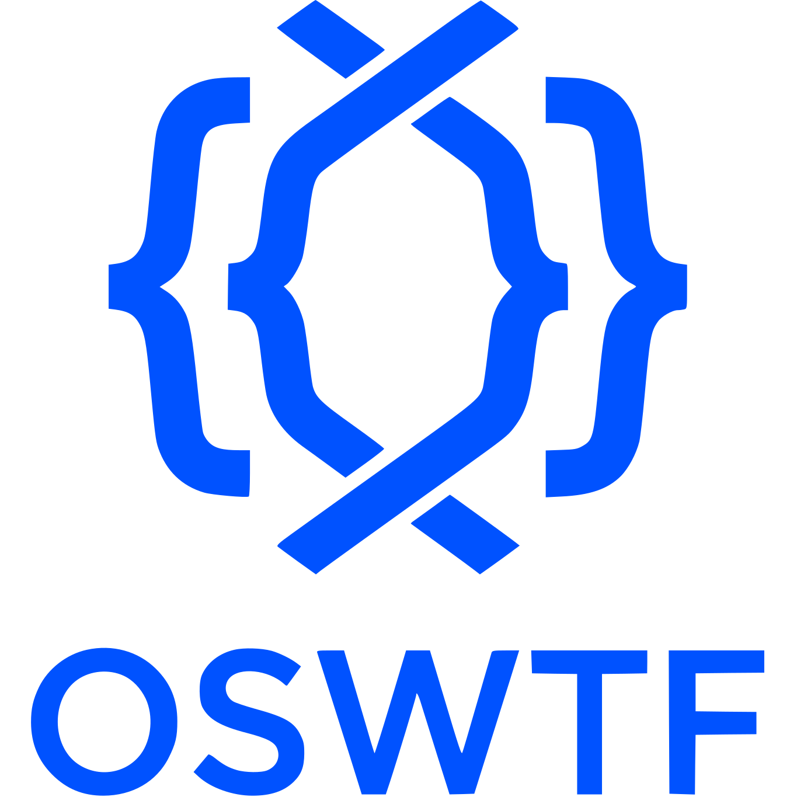

<p align="center">
  <picture>
    <source media="(prefers-color-scheme: dark)" srcset="assets/dojo-logo-dark.svg">
    <source media="(prefers-color-scheme: light)" srcset="assets/dojo-logo-light.svg">
    
  </picture>
</p>

<h3 align="center">🥋 A package manager for AI agent skills</h3>

<p align="center">
  <a href="https://www.npmjs.com/package/@opensourcewtf/dojo"></a>
  <a href="https://opensource.org/licenses/MIT"></a>
  <a href="https://github.com/OpenSourceWTF/dojo"></a>
</p>

<p align="center">
  Install skills once, use them across <strong>Claude</strong>, <strong>Gemini</strong>, <strong>Cursor</strong>, and <strong>Codex</strong>.
</p>

---

## ⚡ Quick Start

```bash
# Install globally
npm install -g @opensourcewtf/dojo

# Search for skills
dojo search testing

# Install a skill
dojo learn test-generation

# Install an MCP server
dojo learn --mcp playwright
```

---

## ✨ Features

| Feature | Description |
|---------|-------------|
| 🔍 **Search** | Fuzzy search across 80+ skills from the curated registry |
| 📦 **Multi-Agent Install** | One command installs to Claude, Gemini, Cursor, and Codex |
| 🔌 **MCP Server Setup** | Auto-configures MCP servers with env var prompting |
| 🔗 **Skill Syncing** | Keep skills consistent across all your AI agents |
| ⚡ **CLI Detection** | Automatically detects which agents you have installed |
| 🛡️ **Registry Isolation** | Caches are namespaced by registry URL to prevent conflicts |

---

## 🤖 Supported Agents (21)

Dojo supports 21 AI coding assistants across three categories:

### Core Agents

| Agent | Skill Directory | Format | MCP Config |
|-------|-----------------|--------|------------|
| **Claude** | `.claude/skills/{skill}/SKILL.md` | folder-skill | `~/.claude.json` |
| **Gemini** | `.gemini/skills/{skill}/SKILL.md` | folder-skill | `~/.gemini/settings.json` |
| **Antigravity** | `.agent/workflows/{skill}.md` | flat-md | `~/.gemini/antigravity/mcp_config.json` |
| **Cursor** | `.cursor/rules/{skill}/RULE.md` | folder-rule | `~/.cursor/mcp.json` |
| **Codex** | `.codex/skills/{skill}/SKILL.md` | folder-skill | — |

### CAM-Compatible Agents

These agents are compatible with [block/ai-rules](https://github.com/block/ai-rules):

| Agent | Skill Directory | Format | MCP Config | Docs |
|-------|-----------------|--------|------------|------|
| **Amp** | `.agents/skills/{skill}/SKILL.md` | folder-skill | — | Sourcegraph Amp |
| **Cline** | `.clinerules/{skill}.md` | flat-md | (UI Settings) | [docs.cline.bot](https://docs.cline.bot/features/cline-rules) |
| **Copilot** | `.github/copilot-instructions/{skill}.md` | flat-md | — | GitHub Copilot |
| **Firebender** | `.firebender/skills/{skill}/SKILL.md` | folder-skill | — | Firebender |
| **Goose** | `.goose/skills/{skill}.md` | flat-md | — | Block/Square Goose |
| **Kilocode** | `.kilocode/rules/{skill}.md` | flat-md | — | Kilocode |
| **Roo** | `.roo/rules/{skill}.md` | flat-md | `.roo/mcp.json` | Roo |

### Dojo-Exclusive Agents

Not supported by CAM—unique to Dojo:

| Agent | Skill Directory | Format | MCP Config | Docs |
|-------|-----------------|--------|------------|------|
| **Windsurf** | `.windsurf/workflows/{skill}.md` | flat-md | `~/.codeium/windsurf/mcp_config.json` | [docs.windsurf.com](https://docs.windsurf.com/windsurf/cascade/workflows) |
| **Aider** | `.aider/skills/{skill}.md` | flat-md | — | [aider.chat](https://aider.chat/docs/config/options.html) |
| **Zed AI** | `.zed/skills/{skill}.md` | flat-md | `~/.config/zed/settings.json` | [zed.dev/docs/ai/rules](https://zed.dev/docs/ai/rules) |
| **Cody** | `.cody/skills/{skill}.md` | flat-md | — | Sourcegraph Cody |
| **Void** | `.void/skills/{skill}.md` | flat-md | `mcp_config.json` | Void Editor |
| **Junie** | `.junie/skills/{skill}.md` | flat-md | (UI Settings) | [jetbrains.com/help/junie](https://www.jetbrains.com/help/junie/customize-guidelines.html) |
| **Trae** | `.trae/skills/{skill}.md` | flat-md | — | ByteDance Trae |
| **Bolt** | `.bolt/skills/{skill}.md` | flat-md | — | StackBlitz Bolt |
| **Lovable** | `.lovable/skills/{skill}.md` | flat-md | — | Lovable AI |

### Skill Formats

| Format | Structure | Used By |
|--------|-----------|---------|
| `folder-skill` | `{dir}/{skill}/SKILL.md` | Claude, Gemini, Codex, Amp, Firebender |
| `folder-rule` | `{dir}/{skill}/RULE.md` + frontmatter | Cursor |
| `flat-md` | `{dir}/{skill}.md` | All others |

> **Detection:** Dojo automatically detects installed agents by checking if their CLI is in your PATH.

---

## 📖 CLI Reference

### `dojo learn <skill>` (alias: `add`)

Install a skill or MCP server to all detected agents.

```bash
dojo learn test-generation              # Install a skill
dojo learn --mcp playwright             # Install MCP server (auto-finds mcp-playwright)
dojo learn mcp-github --for claude      # Install only to Claude
dojo learn skill-name -g                # Install globally to ~/.dojo/skills
```

**Options:**

| Option | Description |
|--------|-------------|
| `-g, --global` | Install to global `~/.dojo/skills` (shared across projects) |
| `--mcp` | Install MCP servers only (skip skill files) |
| `--for <agents>` | Target specific agents (comma-separated: `claude,gemini,cursor,codex`) |
| `--registry <url>` | Custom registry (local path, `github:owner/repo`, or full URL) |

> **Modal Behavior:** With `--mcp`, Dojo filters search results to only show skills with MCP servers and automatically finds `mcp-<name>` variants.

---

### `dojo search <query>`

Search the skill registry. By default shows only skill files (excludes MCP-only entries).

```bash
dojo search testing             # Find testing skills
dojo search playwright --mcp    # Find MCP servers only
dojo search @anthropics         # Find skills by organization
```

**Options:**

| Option | Description |
|--------|-------------|
| `--mcp` | Show only MCP servers (modal filter) |
| `--registry <url>` | Custom registry URL |

---

### `dojo list` (alias: `ls`)

Show installed skills or configured MCP servers.

```bash
dojo list                       # List installed skill files
dojo list --mcp                 # List configured MCP servers
```

**Options:**

| Option | Description |
|--------|-------------|
| `--mcp` | Show configured MCP servers instead of skills |

---

### `dojo unlearn <skill>` (alias: `rm`)

Remove a skill from agent directories.

```bash
dojo unlearn test-generation           # Remove skill from project
dojo unlearn skill-name -g             # Remove globally
dojo unlearn playwright --mcp          # Remove MCP config only (keep skill files)
dojo unlearn debugging -y              # Skip confirmation
```

**Options:**

| Option | Description |
|--------|-------------|
| `-g, --global` | Remove from global storage and all MCP configs |
| `--mcp` | Remove MCP server config only (keep skill files) |
| `--for <agents>` | Remove from specific agents only |
| `-y, --yes` | Skip confirmation prompt |

> **Note:** Use the exact MCP server name as shown in `dojo list --mcp` (e.g., `playwright`, not `mcp-playwright`).

---

### `dojo sync`

Synchronize skills across all agent formats.

```bash
dojo sync              # Sync skills to all detected agents
dojo sync --force      # Overwrite existing skills
```

**Options:**

| Option | Description |
|--------|-------------|
| `-f, --force` | Overwrite existing skill files |

---

### `dojo cache <action>`

Manage the local registry cache.

```bash
dojo cache info        # Show cache statistics
dojo cache clean       # Clear the cache
```

---

## 🔌 MCP Server Integration

Dojo includes its own MCP server for natural language skill discovery. Once configured, agents can respond to prompts like:

> *"Do you know how to write tests?"*  
> *"Teach me debugging"*

### Auto-Install via CLI

```bash
dojo learn --mcp dojo
```

This automatically configures the MCP server for all detected agents.

### Manual Configuration

**Claude** (`~/.claude.json`):
```json
{
  "mcpServers": {
    "dojo": {
      "command": "npx",
      "args": ["-y", "@opensourcewtf/dojo-mcp"]
    }
  }
}
```

**Gemini CLI** (`~/.gemini/settings.json`):
```json
{
  "mcpServers": {
    "dojo": {
      "command": "npx",
      "args": ["-y", "@opensourcewtf/dojo-mcp"]
    }
  }
}
```

---

## 📦 Packages

| Package | Description |
|---------|-------------|
| [`@opensourcewtf/dojo`](https://www.npmjs.com/package/@opensourcewtf/dojo) | CLI for skill management |
| [`@opensourcewtf/dojo-mcp`](https://www.npmjs.com/package/@opensourcewtf/dojo-mcp) | MCP server for AI agents |

---

## 🗃️ Registry

Skills are sourced from the [dojo-skills](https://github.com/OpenSourceWTF/dojo-skills) registry, cached via jsDelivr CDN for fast, reliable access.

**Registry Categories:**
- `official/` — Skills from Anthropic, Google, OpenAI
- `community/` — Community-contributed skills
- `mcp/` — MCP server configurations

---

## 🛠️ Development

```bash
git clone https://github.com/OpenSourceWTF/dojo.git
cd dojo
pnpm install
pnpm build
pnpm test
```

### Project Structure

```
packages/
├── cli/     # @opensourcewtf/dojo
└── mcp/     # @opensourcewtf/dojo-mcp
```

---

## 📄 License

[MIT](LICENSE) © [OpenSourceWTF](https://github.com/OpenSourceWTF)

---

<p align="center">
  <a href="https://github.com/OpenSourceWTF">
    <picture>
      <source media="(prefers-color-scheme: dark)" srcset="assets/oswtf-logo-dark.svg">
      <source media="(prefers-color-scheme: light)" srcset="assets/oswtf-logo-light.svg">
      
    </picture>
  </a>
</p>
