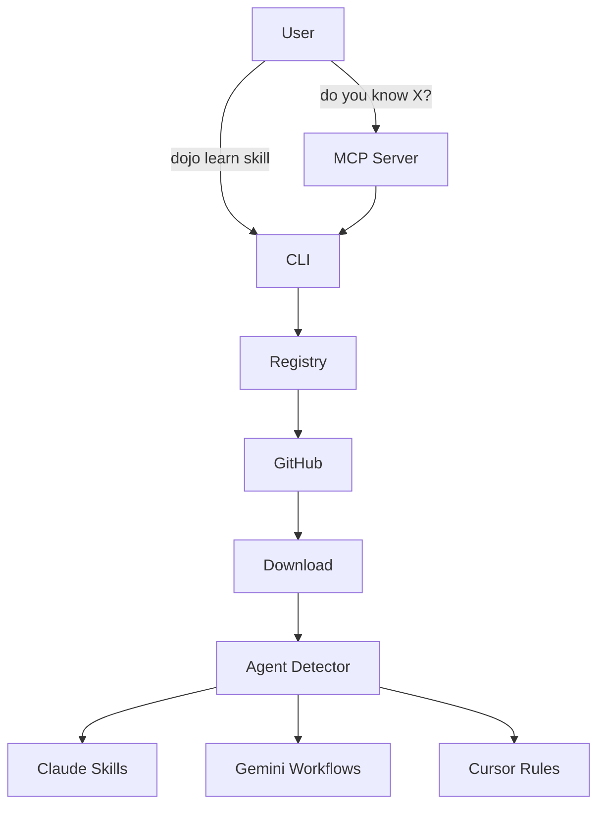
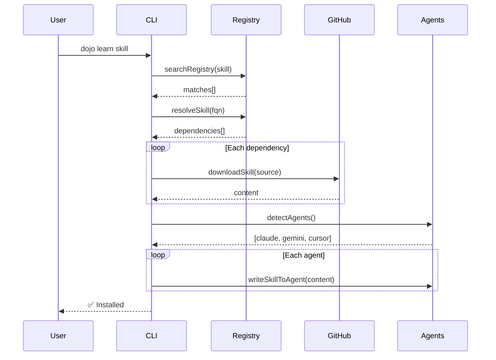

# Dojo Architecture

## Overview

Dojo is a package manager for AI agent skills, enabling discovery and installation of capabilities across multiple AI assistants.



## Packages

### `@opensourcewtf/dojo-cli`
Core CLI handling all skill operations.

**Modules:**
- `commands/` - CLI command handlers (learn, search, list, sync, unlearn)
- `registry/` - Registry loading and search
- `resolver/` - Dependency resolution with cycle detection
- `download/` - GitHub raw API downloader
- `agents/` - Agent directory detection
- `sync/` - Format transformers (Claude → Gemini, Claude → Cursor)

### `@opensourcewtf/dojo-mcp`
MCP server for natural language skill discovery.

**Components:**
- `dojo_learn` tool - Exposed to AI agents
- Hono server - HTTP transport
- CLI integration - Delegates to `@opensourcewtf/dojo-cli`

## Data Flow

### Install Flow


### Registry Structure
```
dojo-skills/registry/
├── official/           # Vendor skills (anthropic.json, google.json)
├── community/          # Community contributions
└── user/               # Local custom skills (gitignored)
```

Each registry file contains:
```json
{
  "_meta": { "source": "github:org/repo", "priority": 100 },
  "skills": {
    "skill-name": {
      "name": "Display Name",
      "path": "skill-path",
      "source": "github:org/repo",
      "dependencies": ["@org/other-skill"],
      "versions": { "latest": "commit-hash" }
    }
  }
}
```

## Agent Format Transformers

| Source | Target | Transform |
|--------|--------|-----------|
| Claude | Gemini | 1:1 copy (both use flat .md) |
| Claude | Cursor | Wrap in folder + add YAML frontmatter |

### Cursor Transform Example
```markdown
# Input (Claude)
# Testing Guide
Instructions for testing...

# Output (Cursor)
---
name: testing-guide
alwaysApply: false
description: Testing Guide
---

# Testing Guide
Instructions for testing...
```

## Extension Points

### Adding New Agent Formats
1. Add detection logic in `agents/detector.ts`
2. Create transformer in `sync/{agent}.ts`
3. Update `writeSkillToAgent()` in `commands/learn.ts`

### Adding Registry Sources
1. Create JSON file in `registry/community/`
2. Follow the skill entry schema
3. Registry loader auto-merges all sources

## Dependencies

```mermaid
graph LR
    MCP[dojo-mcp] --> CLI[dojo-cli]
    CLI --> chalk
    CLI --> commander
    MCP --> @modelcontextprotocol/sdk
    MCP --> hono
```
