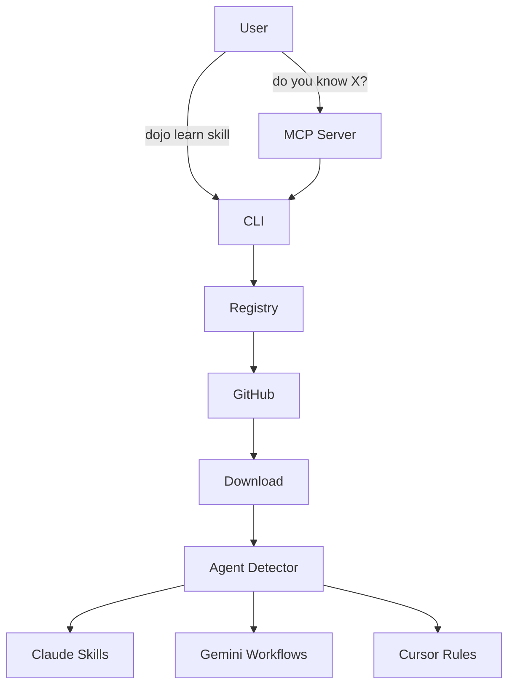
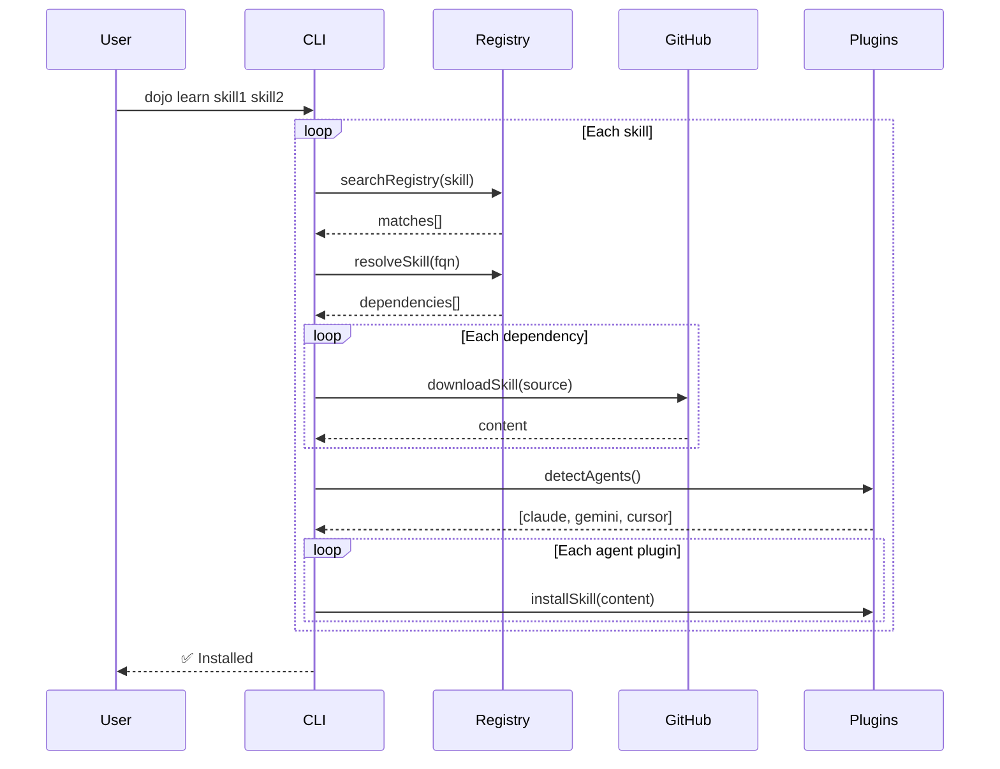

# Dojo Architecture

## Overview

Dojo is a package manager for AI agent skills, enabling discovery and installation of capabilities across multiple AI assistants.



## Packages

### `@opensourcewtf/dojo`
Core CLI handling all skill operations.

**Modules:**
- `commands/` - CLI command handlers (learn, search, list, sync, unlearn)
- `registry/` - Registry loading and search
- `resolver/` - Dependency resolution with cycle detection
- `download/` - GitHub raw API downloader
- `agents/` - Plugin-based agent detection and skill format handling
- `mcp/` - MCP server configuration management
- `sync/` - Format transformers (Claude → Gemini, Claude → Cursor)

### `@opensourcewtf/dojo-mcp`
MCP server for natural language skill discovery.

**Components:**
- `dojo_learn` tool - Exposed to AI agents
- Hono server - HTTP transport
- CLI integration - Delegates to `@opensourcewtf/dojo`

## Data Flow

### Install Flow


### Registry Structure
```
dojo-skills/registry/
├── official/           # Vendor skills (anthropic.json, google.json)
├── community/          # Community contributions
└── mcp/                # MCP server configurations
```

Each registry file contains:
```json
{
  "_meta": { "source": "github:org/repo", "priority": 100 },
  "skills": {
    "skill-name": {
      "name": "Display Name",
      "path": "skill-path",
      "source": "github:org/repo/path.md",
      "dependencies": ["@org/other-skill"],
      "mcp_servers": [{ "name": "server", "package": "@org/pkg" }]
    }
  }
}
```

## Plugin Architecture

### Agent Plugins (`agents/plugins/`)
Each agent has a plugin that defines:
- `name` - Agent identifier
- `cli` - CLI command to detect (e.g., `claude`, `gemini`)
- `agentDir` - Skill directory (e.g., `.claude/skills`)
- `mcpConfig` - MCP configuration file location and format
- `formatPlugin` - Skill file format handler

### Format Plugins (`agents/formats/`)
Define how skills are stored:
- `folder-skill` - `{skill}/SKILL.md` pattern (Claude, Gemini, Codex)
- `folder-rule` - `{skill}/RULE.md` pattern (Cursor)
- `flat-md` - `{skill}.md` flat file pattern (Antigravity)

## CLI Modes

### Modal `--mcp` Flag

| Command | Default | With `--mcp` |
|---------|---------|-------------|
| `learn` | Install skill files | Install MCP config only |
| `unlearn` | Remove skill files + MCP | Remove MCP config only |
| `search` | Show skills only | Show MCP servers only |
| `list` | Show installed skills | Show configured MCPs |

### Variadic Commands
Both `learn` and `unlearn` accept multiple packages:
```bash
dojo learn skill1 skill2 skill3
dojo unlearn pkg1 pkg2 --mcp
```

## Extension Points

### Adding New Agent Formats
1. Create plugin in `agents/plugins/{agent}.ts`
2. Define format plugin or reuse existing from `agents/formats/`
3. Register in `agents/plugins/index.ts`

### Adding Registry Sources
1. Create JSON file in `registry/community/`
2. Follow the skill entry schema
3. Registry loader auto-merges all sources

## Dependencies

```mermaid
graph LR
    MCP[dojo-mcp] --> CLI[dojo]
    CLI --> chalk
    CLI --> commander
    MCP --> @modelcontextprotocol/sdk
    MCP --> hono
```
